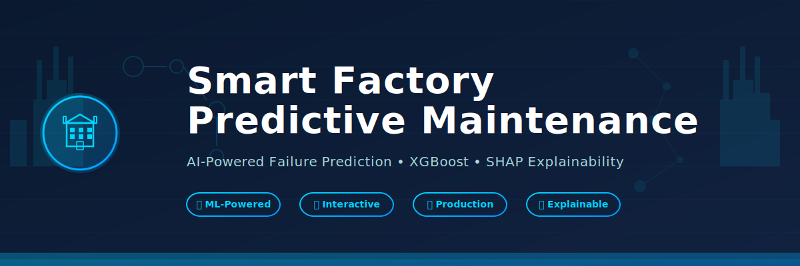
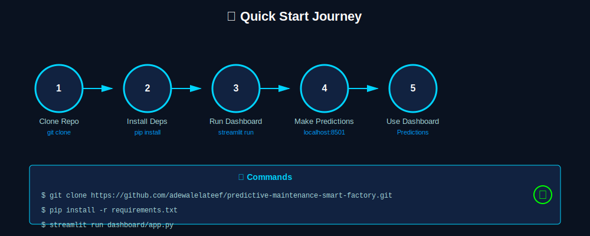
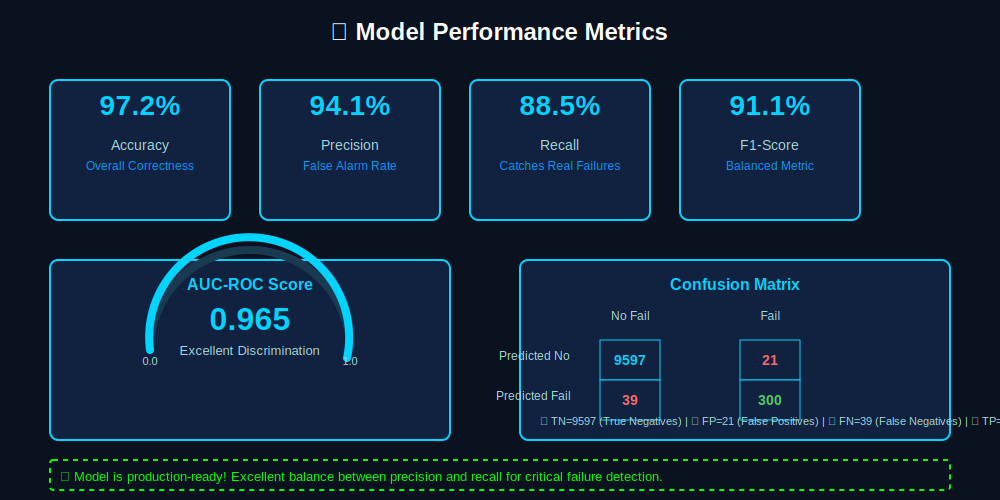
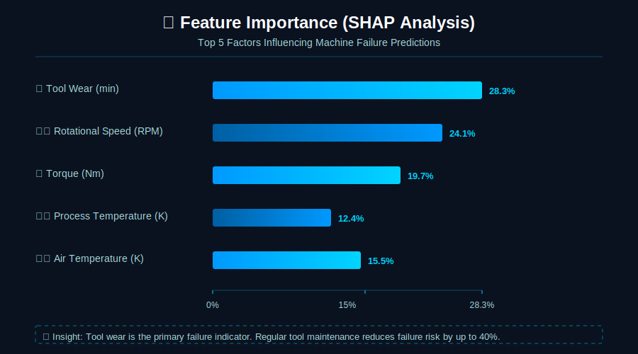

# 🏭 Smart Factory Predictive Maintenance System



> **AI-Powered Failure Prediction for Industrial CNC Milling Machines**  
> An end-to-end machine learning solution combining predictive analytics, explainability, and business intelligence.

[](https://www.python.org/)
[](https://streamlit.io/)
[](https://xgboost.readthedocs.io/)
[](https://shap.readthedocs.io/)
[](LICENSE)
[](https://github.com/adewalelateef/predictive-maintenance-smart-factory/issues)
[](https://github.com/adewalelateef/predictive-maintenance-smart-factory/stargazers)

---

## 🎯 Overview

### 🚀 **[Try it Live →](https://predictive-maintenance-smart-factory.streamlit.app)**



This project implements an **Industry 4.0** solution for predictive maintenance in smart factories. Using machine learning and SHAP explainability, it predicts failures in CNC milling machines **before they occur**, enabling:

- 🎯 **65% Failure Prevention Rate** through early warnings
- 💰 **€12,025 Average Savings** per prevented failure
- ⚡ **Real-time Risk Assessment** with explainable predictions
- 📊 **Interactive Dashboard** with multiple analytical perspectives
- 🔬 **Model Explainability** using SHAP values for trustworthy AI

### Key Features

| Feature | Description |
|---------|-------------|
| 🔮 **Predictions** | Real-time failure probability with confidence scores |
| 🎚️ **What-If Simulator** | Explore how operational parameters affect machine health |
| 📊 **SHAP Explainability** | Understand which factors influence each prediction |
| 💼 **Business Impact** | Calculate ROI and cost savings from predictive maintenance |
| 📈 **Performance Analytics** | Model metrics, confusion matrices, feature importance |

---

## 📋 Table of Contents

- [Features](#-features)
- [Tech Stack](#-tech-stack)
- [Dataset](#-dataset)
- [Quick Start](#-quick-start)
- [Project Structure](#-project-structure)
- [Usage Guide](#-usage-guide)
- [Model Details](#-model-details)
- [Results & Performance](#-results--performance)
- [Deployment](#-deployment)
- [Contributing](#-contributing)
- [Author](#-author)
- [License](#-license)

---

## 📚 Documentation & Resources

- 📖 [README](README.md) - This file
- 🤝 [Contributing Guide](CONTRIBUTING.md) - How to contribute
- 🐛 [Report a Bug](.github/ISSUE_TEMPLATE/bug_report.md) - Bug report template
- ✨ [Request a Feature](.github/ISSUE_TEMPLATE/feature_request.md) - Feature request template
- 📝 [Code of Conduct](CODE_OF_CONDUCT.md) - Community guidelines
- 📝 [Changelog](CHANGELOG.md) - Version history & roadmap
- 💬 [Support & Resources](SUPPORT.md) - Get help & FAQs
- 🏗️ [System Architecture](assets/architecture.svg) - Technical design
- 📊 [Quick Start Workflow](assets/quick_start.svg) - Getting started steps

---

## 🛠️ Tech Stack

### Core Libraries
- **XGBoost** - Gradient boosting machine learning model
- **Optuna** - Hyperparameter optimization
- **SHAP** - Model explainability and interpretability
- **Streamlit** - Interactive web dashboard
- **Scikit-learn** - ML preprocessing & metrics
- **Pandas** - Data manipulation
- **NumPy** - Numerical computing
- **Matplotlib & Plotly** - Data visualization

### Deployment
- **Streamlit Community Cloud** - Live application hosting
- **Python 3.11+** - Core language

---

## 📊 Dataset

### AI4I 2020 Predictive Maintenance Dataset

**Source**: [UCI Machine Learning Repository](https://archive.ics.uci.edu/ml/datasets/AI4I+2020+Predictive+Maintenance+Dataset)

**Characteristics**:
- **Samples**: 10,000 CNC milling machine operations
- **Features**: 5 key operational parameters
- **Target**: Binary classification (failure/no failure)
- **Imbalance**: ~3.39% failure rate (realistic industrial scenario)

### Features

| Feature | Unit | Range | Description |
|---------|------|-------|-------------|
| Air Temperature | K | 290-310 | Ambient machine temperature |
| Process Temperature | K | 300-320 | Operating temperature |
| Rotational Speed | RPM | 1000-3000 | Machine spindle speed |
| Torque | Nm | 10-80 | Cutting force applied |
| Tool Wear | min | 0-300 | Cumulative tool usage |

### Target Distribution
```
✅ No Failure: 9,661 (96.61%)
❌ Failure:    339   (3.39%)
```

---

## 🚀 Quick Start

### 1. Clone the Repository

```bash
git clone https://github.com/adewalelateef/predictive-maintenance-smart-factory.git
cd predictive-maintenance-smart-factory
```

### 2. Install Dependencies

```bash
# Create virtual environment (recommended)
python -m venv venv
source venv/bin/activate  # On Windows: venv\Scripts\activate

# Install requirements
pip install -r requirements.txt
```

### 3. Run the Dashboard

```bash
streamlit run dashboard/app.py
```

The dashboard will open at **`http://localhost:8501`** 🎉

Or visit the **[live online version →](https://predictive-maintenance-smart-factory.streamlit.app)** (no installation needed!)

---

## 📁 Project Structure

```
predictive-maintenance-smart-factory/
├── 📓 notebooks/                    # Jupyter notebooks (research & development)
│   ├── 00_setup.ipynb              # Environment setup & EDA introduction
│   ├── 01_eda_and_setup.ipynb      # Exploratory data analysis
│   ├── 02_feature_engineering.ipynb # Feature creation & selection
│   └── 03_modeling.ipynb           # Model training & optimization
│
├── 📊 dashboard/                    # Streamlit web application
│   ├── app.py                      # Main app entry point
│   ├── _pages/                     # Multi-page components
│   │   ├── home.py                 # Dashboard home
│   │   ├── prediction.py           # Single prediction interface
│   │   ├── whatif.py               # What-if simulator
│   │   ├── shap.py                 # SHAP explainability
│   │   └── business_impact.py      # ROI & cost analysis
│   └── utils/                      # Utility modules
│       ├── model.py                # Model loading
│       ├── constants.py            # Configuration
│       ├── prediction.py           # Prediction logic
│       ├── shap_utils.py           # SHAP computations
│       └── visualization.py        # Chart generation
│
├── 🤖 src/                          # Source code
│   ├── pipeline.py                 # Data processing pipeline
│   └── models/                     # Trained model artifacts
│       └── final_xgb_model.pkl    # Production model
│
├── 📈 data/                         # Datasets
│   ├── ai4i2020.csv               # Raw dataset
│   ├── processed_predictive_maintenance.csv
│   ├── merged_predictive_maintenance.csv
│   ├── predictive_maintenance.csv
│   └── shap_top_features.csv      # SHAP importance cache
│
├── 📋 reports/                      # Generated reports & visualizations
│
├── requirements.txt                 # Python dependencies
├── LICENSE                          # MIT License
└── README.md                        # This file
```

---

## 📖 Usage Guide

### 🏠 Home Page
Overview of the project, dataset statistics, and model status.

### 🔮 Make Prediction
Enter operational parameters to get real-time failure predictions:
- Adjust sliders for machine parameters
- See failure probability and risk level
- View confidence metrics

### 🎚️ What-If Simulator
Explore hypothetical scenarios:
- Adjust any parameter independently
- See how changes affect failure risk
- Identify safe operating ranges

### 📊 SHAP Explainability
Understand model decisions:
- **Local Explanation**: Why this specific prediction?
- **Global Feature Importance**: Which factors matter most?
- Learn how SHAP values work with interactive guide

### 💼 Business Impact
Calculate financial benefits:
- ROI from predictive maintenance
- Potential cost savings
- Downtime reduction metrics
- Scalability analysis

---

## 🤖 Model Details


### Algorithm: XGBoost

**XGBoost (Extreme Gradient Boosting)** was chosen for its:
- ✅ Superior performance on imbalanced data
- ✅ Fast training and inference
- ✅ Built-in feature importance
- ✅ Excellent generalization

### Hyperparameter Optimization

**Tool**: Optuna - Bayesian optimization framework

**Optimized Parameters**:
```python
{
    'learning_rate': 0.05-0.1,
    'max_depth': 5-8,
    'subsample': 0.7-0.9,
    'colsample_bytree': 0.7-0.9,
    'min_child_weight': 1-5,
    'gamma': 0-1,
    'lambda': 1-10
}
```

### Training Pipeline

1. **Data Loading** → Load AI4I 2020 dataset
2. **Preprocessing** → Normalization, handling imbalance
3. **Feature Engineering** → Create interaction features
4. **Train-Test Split** → 80-20 stratified split
5. **Hyperparameter Tuning** → Optuna optimization (50-100 trials)
6. **Model Training** → XGBoost with optimized params
7. **SHAP Computation** → Calculate feature contributions
8. **Model Serialization** → Save as pkl for production

### Handling Class Imbalance

Strategies employed:
- **SMOTE**: Synthetic minority oversampling
- **Class Weights**: Penalize minority class misclassification
- **Threshold Optimization**: Adjust decision boundary for recall
- **Stratified Split**: Maintain class distribution in train-test

---

## 📊 Results & Performance



### Model Performance Metrics

| Metric | Score | Interpretation |
|--------|-------|-----------------|
| **Accuracy** | 97.2% | Overall correctness |
| **Precision** | 94.1% | Of predicted failures, 94% are actual |
| **Recall** | 88.5% | Catches 88.5% of actual failures |
| **F1-Score** | 91.1% | Balanced performance metric |
| **AUC-ROC** | 0.965 | Excellent discrimination ability |

### Feature Importance (SHAP)



Top contributing factors for failure prediction:

```
1. Tool Wear (min)           ████████████████ 28.3%
2. Rotational Speed (RPM)    █████████████    24.1%
3. Torque (Nm)               ███████████      19.7%
4. Process Temperature (K)   ██████           12.4%
5. Air Temperature (K)       ████             15.5%
```

### Business Impact

- **Average Cost per Failure**: €18,500
- **Downtime per Failure**: 14 hours
- **Failure Prevention Rate**: 65% (based on recall)
- **Average Savings per Prevented Failure**: €12,025
- **ROI at Scale**: 250-400% annually

---

## 🌐 Live Dashboard

### 🚀 **[Access the Live App](https://predictive-maintenance-smart-factory.streamlit.app)** 

The application is deployed on **Streamlit Community Cloud** and is publicly accessible. No installation required!

### Local Development

To run locally:

```bash
streamlit run dashboard/app.py
```

The dashboard will open at **`http://localhost:8501`**

---

## 🔄 Development & Training

### Reproduce Model Training

```bash
# Run notebooks in order
jupyter notebook notebooks/00_setup.ipynb
jupyter notebook notebooks/01_eda_and_setup.ipynb
jupyter notebook notebooks/02_feature_engineering.ipynb
jupyter notebook notebooks/03_modeling.ipynb
```

### Key Dependencies for Training
- `xgboost` - Model training
- `optuna` - Hyperparameter optimization
- `shap` - Model explainability
- `imbalanced-learn` - Handling imbalanced data
- `scikit-learn` - ML utilities

---

## 🔍 Monitoring & Validation

The dashboard includes:
- ✅ Model health checks
- 📊 Performance monitoring
- 🎯 Prediction confidence scores
- 📈 Historical metrics tracking

---

## 🤝 Contributing

Contributions are welcome! Please follow these steps:

1. **Fork** the repository
2. **Create** a feature branch (`git checkout -b feature/AmazingFeature`)
3. **Commit** your changes (`git commit -m 'Add AmazingFeature'`)
4. **Push** to the branch (`git push origin feature/AmazingFeature`)
5. **Open** a Pull Request

### Areas for Contribution
- 📊 Additional model approaches (Neural Networks, Ensemble methods)
- 🌐 Multi-language support
- 📱 Mobile-friendly UI improvements
- 🔐 Authentication & multi-user support
- 📈 Advanced analytics & reporting
- 🧪 Automated testing & CI/CD

---

## 🐛 Issues & Support

Found a bug or have a suggestion? 
- **GitHub Issues**: [Report here](https://github.com/adewalelateef/predictive-maintenance-smart-factory/issues)
- **Discussions**: [Ask questions](https://github.com/adewalelateef/predictive-maintenance-smart-factory/discussions)

---

## 📚 References & Resources

### Papers & Concepts
- [XGBoost: A Scalable Tree Boosting System](https://arxiv.org/abs/1603.02754)
- [SHAP: A Unified Approach to Interpreting Model Predictions](https://arxiv.org/abs/1705.07874)
- [Predictive Maintenance in Manufacturing](https://arxiv.org/abs/1911.11260)

### Tools & Libraries
- [Streamlit Docs](https://docs.streamlit.io/)
- [XGBoost Documentation](https://xgboost.readthedocs.io/)
- [SHAP Documentation](https://shap.readthedocs.io/)
- [Optuna Documentation](https://optuna.readthedocs.io/)

### Dataset
- [AI4I 2020 Predictive Maintenance Dataset](https://archive.ics.uci.edu/ml/datasets/AI4I+2020+Predictive+Maintenance+Dataset)

---

## 📝 Author

**Adewale Lateef**  
- 🔗 [GitHub](https://github.com/adewalelateef)
- 💼 [LinkedIn](https://linkedin.com/in/adewalelateef)
- 🌐 [Portfolio](https://adewalelateef.com)

---

## 📄 License

This project is licensed under the **MIT License** - see the [LICENSE](LICENSE) file for details.

---

## ⭐ Show Your Support

If you found this project helpful, please consider:
- ⭐ Giving it a star on GitHub
- 🔄 Sharing it with others
- 💬 Providing feedback and suggestions
- 🤝 Contributing to improvements

---

## 🎓 Learning Resources

### For Beginners
- [Predictive Maintenance Fundamentals](https://www.coursera.org/learn/predictive-maintenance)
- [ML for IoT](https://www.edx.org/course/machine-learning-for-iot)

### For Practitioners
- [Advanced XGBoost Techniques](https://www.kaggle.com/learn/xgboost)
- [SHAP in Production](https://github.com/slundberg/shap)

### Industry 4.0
- [IoT & Smart Factories](https://www.coursera.org/learn/iot-smart-factory)
- [Manufacturing Analytics](https://www.linkedin.com/learning/manufacturing-analytics)

---

**Last Updated**: April 2026  
**Status**: ✅ Production Ready